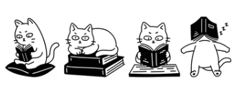

# NekoAI-agent:  

     

≽^⎚⩊⎚^≼ Documenting my journey into the world of AI Agents.  𓆝 𓆟 𓆞 𓆝 𓆟 
Corrections and feedback are always welcome! 

## 🌈 General knowledge collection  
|No.|Topic|Content|
|--|--|--|
|00|[where the story start](docs/Init.md)|Explain LLM, agent, MCP, RAG in overview (Updating...)|
|01|[Understand GCP](docs/GCP-gemini.md)|Understand GCP project and use Gemini models|
|02|[Postgres](docs/postgres.md)|Maintenance postgres database which could be used as vector datbase with pgvector extension|

## 🌟 Practical examples  
|No.|Topic|Content|
|--|--|--|
|01|[Introduction how to use MCP - Your hands and foots](mcp/README.md) |<ul><li> MCP playwright <li>OpenAI client lib <li>Gemini API lib <li>Python asyncio |
|02|[Money lover Telegram Bot - Your face](telegram-bot/README.md) |<ul><li> Money Lover MCP <li>Telegram Bot <li>Gemini API lib <li>Python asyncio |
|03|[Start using Vector database - Your long-term memory](vector-database/README.md) |<ul><li> Vector database <li>Langchain package <li>Postgres pgvector <li>PGVector: add_documents, similarity_search, as_retriever <li>Compare `similarity_search` and `as_retriever` <li>[PostgreSQL Database Maintenance](./docs/postgres.md) |

## 🌳 Books and References  
[1. Vector Databases](https://www.oreilly.com/library/view/vector-databases/9781098177584/)  
[2. Embeddings model](https://ai.google.dev/gemini-api/docs/embeddings#task-types-embeddings-2)
