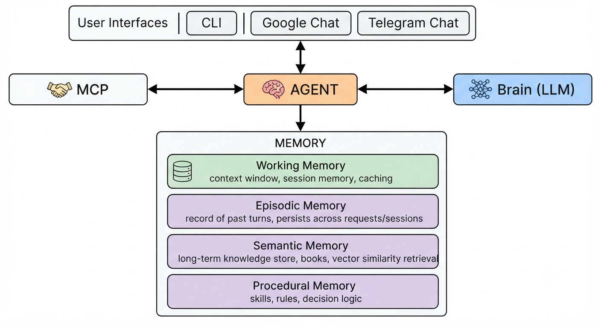
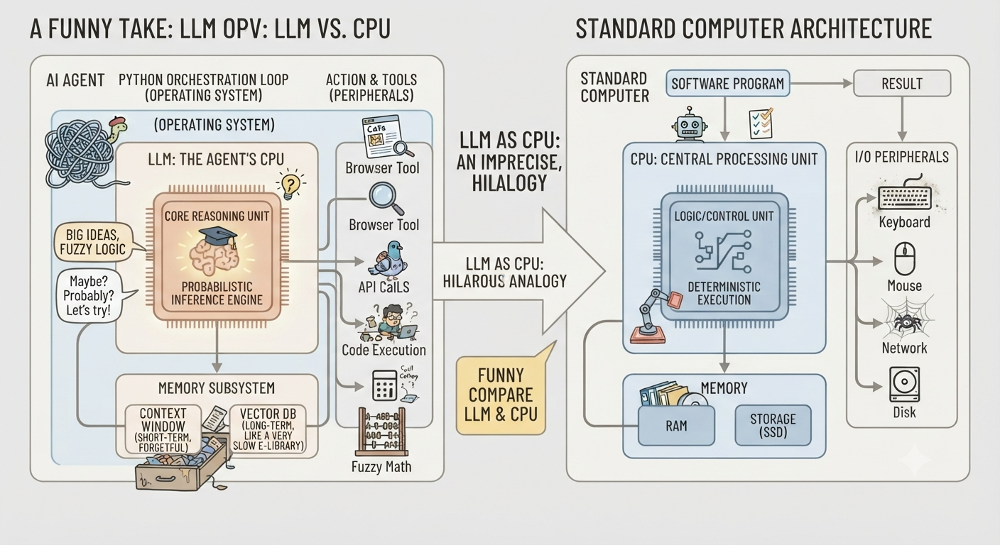

# NekoAI-agent:  

     

≽^⎚⩊⎚^≼ Documenting my journey into the world of AI Agents.  𓆝 𓆟 𓆞 𓆝 𓆟 
Corrections and feedback are always welcome! 

## 🌈 FOUNDATION 
|#|TOPIC|DESCRIPTION|
|--|--|--|
|00|[Read first](foundation/docs/ai-agent-explain.md)|Overview of AI agents: what they are and why they are necessary.|
|01|[Funny compare LLM vs CPU](foundation/docs/llm-cpu.md)|Brains, Bytes, and Blueprints: Why the LLM-as-CPU Metaphor Rocks (Until It Doesn't)|
|02|[Setup GCP project and billing](foundation/docs/GCP-gemini.md)|Understand GCP project and use Gemini models|
|03|[Postgres database](foundation/docs/postgres.md)|Maintenance postgres database which could be used as vector datbase with pgvector extension|
|04|[Start using MCP - Your hands and foots](foundation/mcp/README.md) |<ul><li> MCP playwright <li>OpenAI client lib <li>Gemini API lib <li>Python asyncio |
|05|[Chat with Telegram Bot - Your face](foundation/telegram-bot/README.md) |<ul><li> Money Lover MCP <li>Telegram Bot <li>Gemini API lib <li>Python asyncio |
|06|[Start using Vector database - Your long-term memory](foundation/vector-database/README.md) |<ul><li> Vector database <li>Langchain package <li>Postgres pgvector <li>PGVector: add_documents, similarity_search, as_retriever <li>Compare `similarity_search` and `as_retriever` <li>[PostgreSQL Database Maintenance](foundation/docs/postgres.md) |
|07|[Talk about memory](foundation/memory/README.md) *(Updating ...)*|<ul><li> Named-entity recognition (NER) |

## 🌳 BOOKS AND REFERENCES
|BOOKS|DOCUMENTS|
|--|--|
|[Vector Databases](https://www.oreilly.com/library/view/vector-databases/9781098177584/) [Managing Memory for AI Agents](https://www.oreilly.com/library/view/managing-memory-for/9798341661257/)|[Gemini Embeddings model](https://ai.google.dev/gemini-api/docs/embeddings#task-types-embeddings-2)|