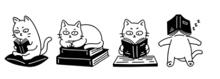
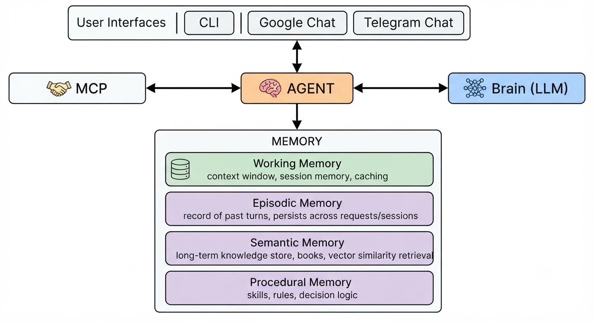
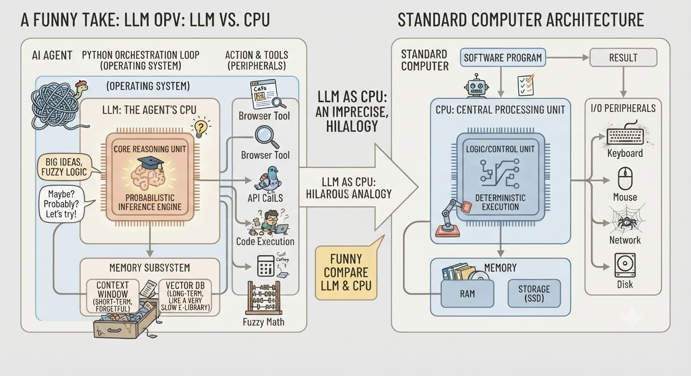

# NekoAI-agent:  
<p align="center">
     
</p>
<p align="center">
≽^⎚⩊⎚^≼ Documenting my journey into the world of AI Agents.  𓆝 𓆟 𓆞 𓆝 𓆟<br>
Corrections and feedback are always welcome! 
</p>

## 🌈 FOUNDATION 
Core concepts and building blocks for AI agents: from understanding what agents are, to implementing memory systems, MCP integrations, and vector databases. Each topic builds upon the previous one, creating a complete foundation for agent development.

|#|TOPIC|DESCRIPTION|
|--|--|--|
|00|[Read first](foundation/docs/ai-agent-explain.md)|Overview of AI agents: what they are and why they are necessary.<br>|
|01|[Funny compare LLM vs CPU](foundation/docs/llm-cpu.md)|Brains, Bytes, and Blueprints: Why the LLM-as-CPU Metaphor Rocks (Until It Doesn't).<br>|
|02|[Setup GCP project and billing](foundation/docs/GCP-gemini.md)|Understand GCP project and use Gemini models|
|03|[Postgres database](foundation/docs/postgres.md)|Maintenance postgres database which could be used as vector datbase with pgvector extension|
|04|[Start using MCP - Your hands and foots](foundation/mcp/README.md) |<ul><li> MCP playwright<br><li>OpenAI client lib<br><li>Gemini API lib<br><li>Python asyncio |
|05|[Chat with Telegram Bot - Your face](foundation/telegram-bot/README.md) |<ul><li> Money Lover MCP<br><li>Telegram Bot<br><li>Gemini API lib<br><li>Python asyncio |
|06|[Start using Vector database - Your long-term memory](foundation/vector-database/README.md) |<ul><li> Vector database<br><li>Langchain package<br><li>Postgres pgvector<br><li>PGVector: add_documents, similarity_search, as_retriever<br><li>Compare `similarity_search` and `as_retriever`<br><li>[PostgreSQL Database Maintenance](foundation/docs/postgres.md) |
|07|[Talk about memory](foundation/memory/README.md) *(Updating ...)*|<ul><li> Named-entity recognition (NER) |

## 🦁 CLAUDE PROJECTS
Real-world AI agent implementations using Claude Code. These projects demonstrate advanced patterns like custom agents, skills, slash commands, and domain-specific workflows for DevOps daily work.

|PROJECT|DESCRIPTION|
|--|--|
|[IncidentChecker](claude-projects/IncidentChecker/README.md)|Multi-cloud incident response (GCP, AWS, K8s) with memory system and Terraform inspection|
|[Jaeger](claude-projects/Jaeger/README.md)|Distributed tracing and observability for Claude Code sessions using OpenTelemetry and Jaeger|

## 🌳 BOOKS AND REFERENCES
Curated learning resources for deepening your understanding of AI agents, vector databases, memory management, and embeddings. These materials complement the hands-on examples in this repository.

|BOOKS|DOCUMENTS|
|--|--|
|[Vector Databases](https://www.oreilly.com/library/view/vector-databases/9781098177584/)<br>[Managing Memory for AI Agents](https://www.oreilly.com/library/view/managing-memory-for/9798341661257/)|[Gemini Embeddings model](https://ai.google.dev/gemini-api/docs/embeddings#task-types-embeddings-2)|

---

```
⠀⣀⠀⠀⠀⠀⠀⠀⠀⠀⠀⢀⣀⠀⠀⠀⠀⠀⠀⠀⠀⣀⣠⣶⣿⣶⡾⠁
⠠⣿⡀⠀⠀⠀⢀⣀⣤⣶⣿⣿⣿⣿⣿⣿⣿⣿⣿⣿⣿⣿⣿⣿⣿⣿⡿⠀
⠀⠙⢿⣶⣶⣾⣿⠿⢿⣿⣿⣿⣿⣿⣿⣿⣿⣿⣿⣿⣿⣿⣿⡿⠛⠿⠃⠀
⠀⠀⠀⠀⠀⠀⠀⠀⢸⣿⣿⣿⣿⣿⣿⣿⣿⣿⣿⣿⣿⣿⣿⡃⠀⠀⠀⠀
⠀⠀⠀⠀⠀⠀⠀⣰⣿⣿⢿⣿⣿⠟⠁⠀⠀⠀⠈⢿⣿⠛⠻⢿⣦⡀⠀⠀
⠀⠀⠀⠀⠀⠀⠀⣿⠟⠁⠘⢿⣿⠀⠀⠀⠀⠀⠀⠸⣿⡀⠀⠀⠹⠷⠀⠀
⠀⠀⠀⠀⠀⠀⠀⣿⣤⠀⠀⠀⠙⠷⠶⠀⠀⠀⠀⠀⠙⠛⠁⠀⠀⠀⠀⠀
```

*"In this vast expanse of being lost, that lamp doesn't show the way. It merely casts a gentle light into the dark corners of uncertainty, a quiet reminder that even when we are wandering without a destination, there is still a place to pause and catch our breath." - Neko*

---