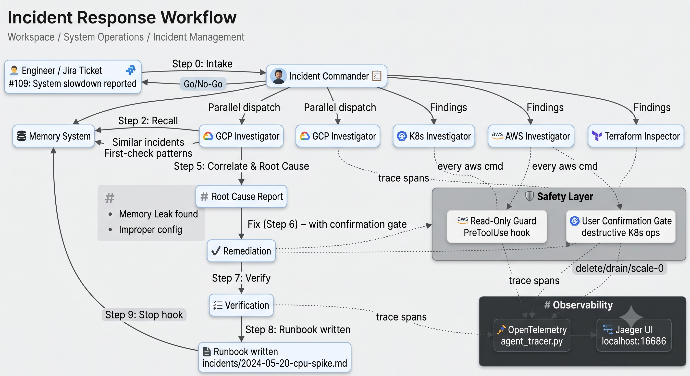
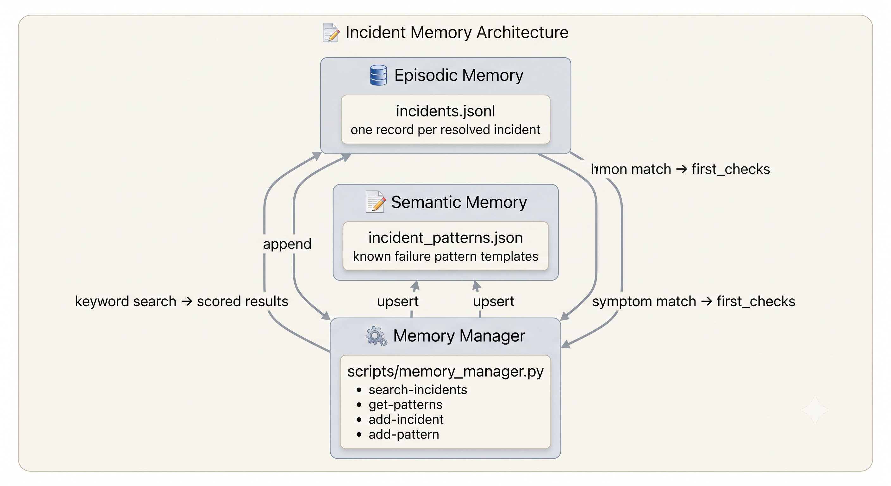

# IncidentChecker

AI-assisted incident response system for Google Cloud Platform (GCP), AWS, and Kubernetes environments using Claude Code.

## Overview

This project provides intelligent agents that help diagnose infrastructure issues, investigate failing workloads, and trace problems to resolution across multi-cloud environments. It maintains both episodic memory (past incidents) and semantic memory (known failure patterns) to accelerate future investigations.

> **Built with Claude Code**: This project follows [Claude Code](https://claude.ai/code) conventions and patterns. The project structure, agent definitions, skills, and hooks are based on Claude Code's [official documentation](https://github.com/anthropics/claude-code). For more information about Claude Code concepts (agents, skills, hooks, memory systems), see the [Claude Code documentation](https://github.com/anthropics/claude-code/blob/main/README.md).

<p align="center">
     
</p>
<p align="center">

## Features

- **Multi-cloud investigation**: GCP, AWS, and Kubernetes agents
- **Terraform code inspection**: Review infrastructure-as-code without touching live systems
- **Incident memory system**: Learn from past incidents to speed up future diagnosis
- **Jira integration**: Read tickets and extract incident input fields
- **Runbook generation**: Automatically document incident response with root cause analysis

## Quick Start

### Prerequisites

- **Claude Code** installed ([download](https://claude.ai/code))
  - CLI: `brew install claude` (macOS) or see [installation guide](https://github.com/anthropics/claude-code)
  - Desktop app: Available for macOS and Windows
  - Web: [claude.ai/code](https://claude.ai/code)
  - VS Code / JetBrains extensions: Available in respective marketplaces
- `gcloud` CLI authenticated (for GCP investigations)
- `kubectl` configured (for Kubernetes investigations)
- `aws` CLI configured (for AWS investigations)
- macOS Keychain (for secure credential storage)

### Setup

1. **Clone and configure**
   ```bash
   cd /path/to/IncidentChecker
   ```

2. **Customize for your environment** - Replace placeholder values:
   - `jira.example.com` → your Jira instance URL
   - `user@example.com` → your email
   - `~/terraform-repos/` → your infrastructure repository path
   - `customfield_XXXXX` → your Jira custom field IDs

3. **Set up credentials** (macOS Keychain):
   ```bash
   # Jira API token
   security add-generic-password -U -s JiraAPIToken -a your-email@example.com -w

   # Bitbucket API token (if using Bitbucket PR review)
   security add-generic-password -U -s BitbucketAPIToken -a your-email@example.com -w
   ```

4. **Configure environment variables**:
   ```bash
   export GCP_PROJECT=your-gcp-project-id
   export K8S_CONTEXT=your-kubectl-context
   export K8S_NAMESPACE=default
   export JIRA_BASE_URL=https://jira.example.com
   export JIRA_EMAIL=your-email@example.com
   ```

5. **Customize repository patterns**:
   Edit `scripts/discover_repos.py` to match your organization's repository naming conventions.

## Available Skills

[Skills](https://github.com/anthropics/claude-code/blob/main/docs/skills.md) are invoked with slash commands in Claude Code:

| Skill | Description |
|-------|-------------|
| `/gcp-incident` | GCP-focused investigation (quotas, networking, IAM, Cloud SQL, GKE control plane) |
| `/k8s-incident` | Kubernetes workload investigation (pods, deployments, HPA, events, OOMKill, CrashLoops) |
| `/incident-runbook` | Generate structured runbook from symptoms → root cause → resolution |
| `/read-jira` | Fetch Jira ticket details and extract incident input fields |
| `/bitbucket-pr-review` | Authenticate with Bitbucket, fetch PR diff, and review Terraform code |

Skills are defined in `.claude/skills/*.md` and provide reusable investigation workflows.

## Available Agents

[Agents](https://github.com/anthropics/claude-code/blob/main/docs/agents.md) are specialized subagents with focused tools and instructions:

| Agent | Purpose |
|-------|---------|
| **GCP Investigator** | Queries GCP APIs, reads logs/metrics, checks quotas and IAM |
| **K8s Investigator** | Inspects cluster state via kubectl, finds failing workloads |
| **AWS Investigator** | Diagnoses AWS issues: IAM, VPC, ALB, Route53, CloudWatch, Lambda, S3, KMS |
| **Terraform Inspector** | Reads Terraform code to map infrastructure and detect misconfigurations |
| **Incident Commander** | Orchestrates multiple agents, synthesizes findings, produces incident reports |
| **Requirements Reader** | Extracts structured incident input fields from Jira tickets or markdown files |

Agents are defined in `.claude/agents/*.md` with frontmatter specifying their model, tools, and reasoning effort. Invoke with the `Agent()` tool.

## Incident Workflow

```
0. Intake    → Read Jira ticket or markdown file to understand the issue
1. Plan      → Draft investigation plan and get user approval
2. Recall    → Search memory for similar past incidents
3. Triage    → Understand symptoms, affected services, blast radius
4. Diagnose  → Run relevant investigators based on platform
5. Correlate → Merge findings and identify root cause
6. Fix       → Apply remediation (with confirmation for destructive actions)
7. Verify    → Confirm recovery and check dependent services
8. Runbook   → Document root cause and resolution
9. Remember  → Record incident and update patterns in long-term memory
```

## Memory System

The project maintains two types of memory:
<p align="center">
     
</p>
<p align="center">

### Episodic Memory (`.claude/memory/episodic/incidents.jsonl`)
- Records of resolved incidents
- Includes symptoms, root cause, resolution, lessons learned
- Automatically recorded by the Stop hook when runbooks are completed

### Semantic Memory (`.claude/memory/semantic/incident_patterns.json`)
- Known failure pattern templates by platform (GCP, K8s, AWS, Terraform)
- Maps symptoms to likely root causes and first-check commands
- Must be manually updated after incidents with `add-pattern` command

### Memory Commands

```bash
# Search past incidents
python3 scripts/memory_manager.py search-incidents --keywords "OOMKill,payment-service"

# Get known patterns for a symptom
python3 scripts/memory_manager.py get-patterns --symptom "CrashLoopBackOff"

# Add/update a failure pattern
python3 scripts/memory_manager.py add-pattern --category oom-memory-leak --stdin < pattern.json
```

## Security Features

### AWS Read-Only Guard
A [`PreToolUse` hook](https://github.com/anthropics/claude-code/blob/main/docs/hooks.md) (`scripts/aws_readonly_guard.py`) automatically blocks all mutating `aws` CLI operations. To run write operations, you must:
1. Ask the user for explicit confirmation
2. The user approves the tool call in the permission dialog

This hook is configured in `.claude/settings.json` and runs before every Bash command.

### Automatic Runbook Recording
A [`Stop` hook](https://github.com/anthropics/claude-code/blob/main/docs/hooks.md) (`scripts/session_memory_hook.py`) automatically records completed runbooks to episodic memory when a session ends. No manual intervention needed.

### Credential Security
- All API tokens stored in macOS Keychain, never in code or environment variables
- Tokens always fetched inline: `$(security find-generic-password -s 'TokenName' -w)`
- Never print, echo, or expose tokens

## Project Structure

This project follows the [Claude Code project structure](https://github.com/anthropics/claude-code/blob/main/docs/project-structure.md):

```
IncidentChecker/
├── CLAUDE.md                          # Project documentation for Claude Code (instructions)
├── README.md                          # This file
├── .claude/                           # Claude Code configuration directory
│   ├── settings.json                  # Hooks, permissions, and environment variables
│   ├── agents/                        # Agent definitions (specialized subagents)
│   │   ├── gcp-investigator.md        # GCP-focused incident investigation
│   │   ├── k8s-investigator.md        # Kubernetes workload investigation
│   │   ├── aws-investigator.md        # AWS infrastructure investigation
│   │   ├── terraform-inspector.md     # Terraform code review (read-only)
│   │   ├── incident-commander.md      # Multi-agent orchestration
│   │   └── requirements-reader.md     # Jira/markdown input parser
│   ├── skills/                        # Skill definitions (slash commands)
│   │   ├── gcp-incident.md            # /gcp-incident
│   │   ├── k8s-incident.md            # /k8s-incident
│   │   ├── incident-runbook.md        # /incident-runbook
│   │   ├── read-jira.md               # /read-jira
│   │   └── bitbucket-pr-review.md     # /bitbucket-pr-review
│   └── memory/                        # Long-term memory (persists across sessions)
│       ├── episodic/                  # Incident history
│       │   └── incidents.jsonl
│       └── semantic/                  # Known failure patterns
│           └── incident_patterns.json
├── scripts/                           # Python utilities and hook implementations
│   ├── memory_manager.py              # Memory CRUD operations
│   ├── discover_repos.py              # Repository fingerprinting
│   ├── parse_requirements.py          # Requirement extraction
│   ├── aws_readonly_guard.py          # PreToolUse hook (blocks mutating AWS commands)
│   └── session_memory_hook.py         # Stop hook (auto-records runbooks)
├── knowledge/                         # Repository registry (auto-generated)
└── incidents/                         # Generated runbooks (markdown)
```

### Key Claude Code Concepts Used

- **CLAUDE.md**: Project-specific instructions that Claude Code reads on startup ([docs](https://github.com/anthropics/claude-code/blob/main/docs/claude-md.md))
- **Agents**: Specialized subagents with focused tools and instructions ([docs](https://github.com/anthropics/claude-code/blob/main/docs/agents.md))
- **Skills**: Reusable slash commands that invoke predefined workflows ([docs](https://github.com/anthropics/claude-code/blob/main/docs/skills.md))
- **Hooks**: Shell scripts that run before/after tool calls or session events ([docs](https://github.com/anthropics/claude-code/blob/main/docs/hooks.md))
- **Memory**: Persistent storage for cross-session learning ([docs](https://github.com/anthropics/claude-code/blob/main/docs/memory.md))

## Customization Guide

1. **Repository Discovery** (`scripts/discover_repos.py`):
   - Update `REPO_TYPE_PATTERNS` to match your repository naming conventions
   - Adjust `KNOWN_ENVS` for your environment names

2. **Memory Patterns** (`.claude/memory/semantic/incident_patterns.json`):
   - Add your organization's common failure patterns
   - Customize `first_checks` commands for your infrastructure

3. **Jira Integration** (`.claude/skills/read-jira.md`):
   - Replace `customfield_xxx` with your actual custom field IDs
   - Update field mappings in `requirements-reader.md`

4. **Terraform Repository Path**:
   - Update `~/terraform-repos/` throughout the project to your actual path
   - Configure additional directories in `.claude/settings.json`

## Example Usage

### Investigate a Kubernetes pod failure
```
/k8s-incident

# Claude will:
# 1. Check context and node health
# 2. Inspect pod status and events
# 3. Read logs and describe failing resources
# 4. Identify root cause
# 5. Generate runbook
```

### Read a Jira ticket and start investigation
```
/read-jira TICKET-1234

# Then follow up with platform-specific investigation:
/gcp-incident    # for GCP issues
/k8s-incident    # for Kubernetes issues
```

### Review Terraform code for security issues
```bash
# Use the Terraform Inspector agent
Agent({
  subagent_type: "Terraform Inspector",
  prompt: "Review ~/terraform-repos/platform-terraform for security misconfigurations"
})
```

## Contributing

When adding new incident patterns:
1. Document the pattern in `.claude/memory/semantic/incident_patterns.json`
2. Include platform, symptoms, first_checks, and resolution
3. Update after each incident to improve future investigations

## Learning More About Claude Code

This project demonstrates several Claude Code features:

- **[Agents](https://github.com/anthropics/claude-code/blob/main/docs/agents.md)**: Specialized subagents for GCP, K8s, AWS, and Terraform
- **[Skills](https://github.com/anthropics/claude-code/blob/main/docs/skills.md)**: Reusable slash commands for investigation workflows
- **[Hooks](https://github.com/anthropics/claude-code/blob/main/docs/hooks.md)**: PreToolUse (AWS guard) and Stop (auto-recording)
- **[Memory](https://github.com/anthropics/claude-code/blob/main/docs/memory.md)**: Episodic (incident history) and semantic (failure patterns)
- **[CLAUDE.md](https://github.com/anthropics/claude-code/blob/main/docs/claude-md.md)**: Project-specific instructions
- **[Settings](https://github.com/anthropics/claude-code/blob/main/docs/settings.md)**: Permissions, environment variables, and hook configuration

For more examples and patterns, see:
- [Claude Code Documentation](https://github.com/anthropics/claude-code)
- [Claude Code Examples](https://github.com/anthropics/claude-code/tree/main/examples)
- [Agent SDK](https://github.com/anthropics/claude-code/blob/main/docs/agent-sdk.md)

## License

This project is a template for incident response. Customize it for your organization's needs.

## Support

**For Claude Code questions or issues:**
- Documentation: https://github.com/anthropics/claude-code
- Issues: https://github.com/anthropics/claude-code/issues
- Help command: `/help` in Claude Code CLI

**For this project template:**
- Customize for your infrastructure and organization
- Replace all placeholder values (domains, repo paths, Jira URLs)
- Update memory patterns based on your incident history
