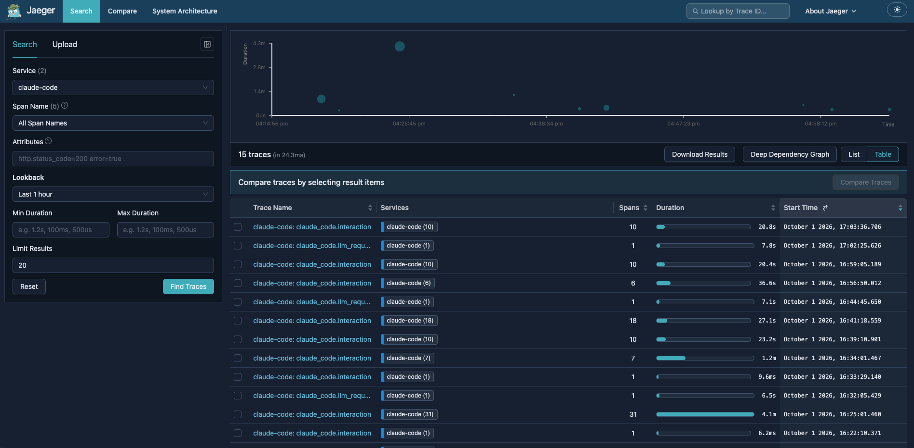

# Jaeger Tracing for Claude Code

Trace and visualize Claude Code's internal operations using Jaeger distributed tracing. This setup enables observability into agent workflows, tool calls, and LLM interactions through OpenTelemetry traces.

## What This Does

Jaeger captures detailed traces of Claude Code sessions, showing:
- Agent spawning and lifecycle
- Tool invocations (Read, Edit, Bash, etc.)
- LLM prompt/response timing
- Workflow orchestration and parallel operations
- Performance bottlenecks and timing analysis

<p align="center">
     
</p>
<p align="center">

## Prerequisites

- Jaeger binary from [jaegertracing/jaeger releases](https://github.com/jaegertracing/jaeger)
- Claude Code CLI
- OpenTelemetry collector configuration (see `otel-collector-config.yaml`)

## Setup

### 1. Install Jaeger

Download the latest Jaeger binary from the releases page:
```bash
https://github.com/jaegertracing/jaeger/releases
```

### 2. Configure Persistent Storage

Create directories for Jaeger's BadgerDB storage:
```bash
# Setup for persistent storage
mkdir -p "$HOME/STRACE/jaeger-badger/keys"
mkdir -p "$HOME/STRACE/jaeger-badger/values"
```

### 3. Start Jaeger

Launch Jaeger with the OpenTelemetry collector configuration:
```bash
./jaeger --config otel-collector-config.yaml
```

Access the Jaeger UI at `http://localhost:16686`

### 4. Configure Claude Code Telemetry

Before running `claude`, export these environment variables:

```bash
# Enable telemetry in Claude Code
export CLAUDE_CODE_ENABLE_TELEMETRY=1
export CLAUDE_CODE_ENHANCED_TELEMETRY_BETA=1

# Configure OpenTelemetry trace export
export OTEL_TRACES_EXPORTER=otlp
export OTEL_EXPORTER_OTLP_TRACES_ENDPOINT="http://localhost:4318/v1/traces"
export OTEL_EXPORTER_OTLP_TRACES_PROTOCOL="http/protobuf"

# Optional: Enable detailed span context for prompts and tool details
export OTEL_LOG_USER_PROMPTS=1
export OTEL_LOG_TOOL_DETAILS=1

# Disable logs and metrics exporters (traces only)
export OTEL_LOGS_EXPORTER="none"
export OTEL_METRICS_EXPORTER="none"

# Optional: For debugging, reduce export intervals
# Reset these for production use
export OTEL_METRIC_EXPORT_INTERVAL=10000  # 10 seconds (default: 60000ms)
export OTEL_LOGS_EXPORT_INTERVAL=5000     # 5 seconds (default: 5000ms)
```

### 5. Run Claude Code

```bash
claude
```

All operations will now be traced to Jaeger.

## Usage

1. Start Jaeger backend
2. Source the environment variables in your shell
3. Run Claude Code normally
4. View traces in Jaeger UI at `http://localhost:16686`
5. Search for traces by service name, operation, or tags
6. Analyze agent workflows, timing, and tool call patterns

## Tips

- **Filter by operation**: Search for specific tool calls like `Read`, `Edit`, or `Agent`
- **Analyze duration**: Identify slow operations or bottlenecks in agent workflows
- **View dependencies**: See how subagents and parallel operations relate
- **Debug failures**: Trace errors back to the specific tool call or LLM interaction
- **Monitor patterns**: Observe common agent behaviors and optimization opportunities