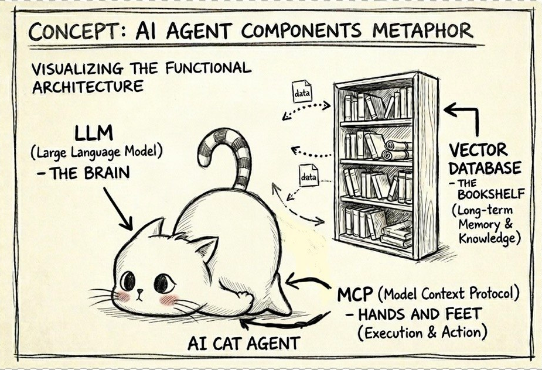
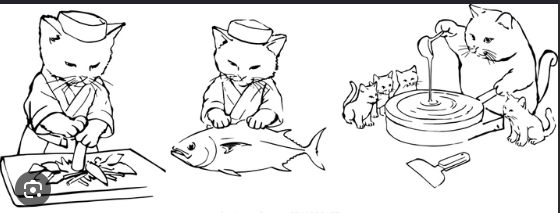

## Journey into AI Agents: My Learning Log

The world is rapidly evolving, and with it, the field of Artificial Intelligence. Many are discussing the capabilities of AI, showcasing daily advancements. This rapid pace can be overwhelming, making it difficult to know where to begin without sifting through extensive books and articles for answers.

This repository serves as my personal learning log, a collection of notes on what I’ve learned and built with AI. It compiles information from books, blogs, and other resources, enriched with my own understanding, questions, and the solutions I’ve discovered. If you’re exploring this repository, I hope it provides a helpful starting point and saves you valuable time.

Let’s begin our exploration.

<p align="center">
 
</p>

## Large Language Models (LLMs)
<p align="center">
 
</p>

Think of an LLM as granting a kitten the ability to understand and respond to human language dynamically. Initially, AI models were limited to basic, predefined responses, much like a newborn kitten only knowing "meow." With the advent of the `transformer` architecture, LLMs enabled a significant leap, allowing our kitten to comprehend nuanced commands and perform complex linguistic tasks.

## Multi-modal, Multi-agent, Multi-tool (MCP) Frameworks

<p align="center">
 
</p>

While LLMs provide understanding, our kitten still needs to interact with the real world—to "cook a meal" or "clean a house," metaphorically speaking. This is where Multi-modal, Multi-agent, Multi-tool (MCP) frameworks become essential. MCP frameworks equip our kitten with the ability to use various tools and access diverse data sources, enabling it to execute complex, real-world actions and bridge the gap between understanding and practical application.

## Vector Databases: The Long-Term Memory of AI  
<p align="center">
 
</p>

▶︎ •၊၊||၊|။||||။‌‌‌‌‌၊|• 0:10  
The master explains so many things that it’s flooding the kitten's head. Now, the kitten needs to store what the master said somewhere so he can look it up later.

Let’s say a 'meow' is a vector. The place to store these vectors is a vector database, which allows for both storage and searching. This search is special: it’s called 'semantic search.' Instead of just finding the exact word 'meow,' it returns 'meow meow meow'—finding things that share the same meaning, even if the words aren't identical.

/ᐠ - ˕ -マ ᶻ 𝗓 𐰁
```
what the master say -- embedding --> meow meow meow ...
```
