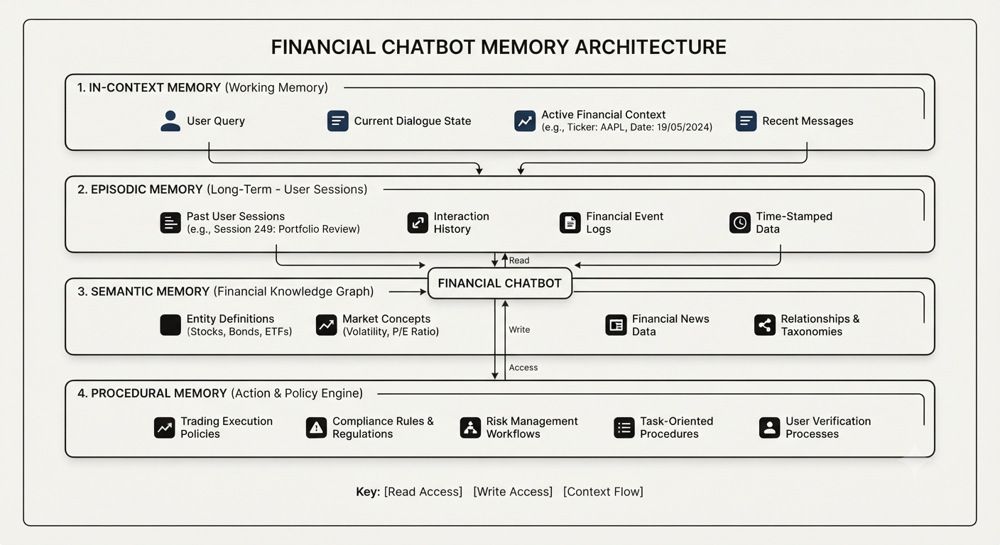

# Financial Chatbot (Google ADK + Gemini + Firestore)

> Reference: *Managing Memory for AI Agents* — Benjamin Labaschin

A personal finance chatbot that demonstrates **all four memory tiers** from the book using Google ADK Python, Gemini 3.6 Flash, and GCP Firestore.



### Memory Architecture

```
┌──────────────────────────────────────────────────────────────────┐
│  MEMORY TIER        │  STORE             │  LIFETIME             │
├──────────────────────────────────────────────────────────────────┤
│  In-Context         │  ADK session       │  Current turn only    │
│  Episodic           │  Firestore         │  Cross-session        │
│  Semantic           │  Firestore         │  Persistent (facts)   │
│  Procedural         │  ADK FunctionTools │  Always available     │
└──────────────────────────────────────────────────────────────────┘
```

| Memory Type | What it stores | GCP Service |
|---|---|---|
| In-Context (Working) | Current conversation window | ADK `InMemorySessionService` |
| Episodic | Past session summaries + topics | Firestore `users/{id}/episodes` |
| Semantic | User profile: income, goals, risk | Firestore `users/{id}/meta/profile` |
| Procedural | Budget, savings, investment, Money Lover tools | ADK `FunctionTool` |

### Procedural Tools (ADK FunctionTools)

- `calculate_budget` — 50/30/20 rule analysis
- `calculate_savings_timeline` — months to reach a goal with compound interest
- `suggest_investment_allocation` — asset allocation by risk tolerance (low / medium / high)
- `analyze_expense_breakdown` — categorise expenses into Needs / Wants / Other
- `get_money_lover_transactions` — fetch real transactions from a Money Lover account

### Money Lover Integration

`get_money_lover_transactions` calls the Money Lover web API to pull real spending data.

**Authentication** — Money Lover's login requires OAuth + reCAPTCHA (browser-based), so the token must be copied manually from a browser session:

1. Open [web.moneylover.me](https://web.moneylover.me) and log in
2. Open DevTools → Network tab → click any request to `/api/`
3. Copy the `authorization` header value (the JWT after `AuthJWT `)
4. Add to your `.env`:

```env
MONEY_LOVER_TOKEN=<paste token here>
MONEY_LOVER_REFRESH_TOKEN=<optional — from localStorage.refresh_token in DevTools Console>
```

With `MONEY_LOVER_REFRESH_TOKEN` set, the app silently refreshes the access token so sessions stay alive longer.

**Parameters the agent can pass:**

| Parameter | Description |
|---|---|
| `start_date` | Start of date range (`YYYY-MM-DD`) |
| `end_date` | End of date range (`YYYY-MM-DD`) |
| `wallet_name` | Optional wallet name substring filter (e.g. `"Cash"`, `"VCB"`) |

**Example prompts:**
- "Show me my Money Lover transactions from August 2026"
- "What did I spend on food last month from my VCB wallet?"

**Tracing** — every Money Lover API call is logged to `traces.log` in the project root:

```
2026-09-01T13:45:00 INFO ML get_money_lover_transactions called | start=2026-08-01 end=2026-08-31 wallet_name=''
2026-09-01T13:45:00 INFO ML POST https://web.moneylover.me/api/wallet/list → 200 (143ms)
2026-09-01T13:45:01 INFO ML POST https://web.moneylover.me/api/transaction/list → 200 (310ms) | wallet='Cash'
2026-09-01T13:45:01 INFO ML get_money_lover_transactions done | wallets=['Cash'] tx_count=42 income=5000000.0 expense=-3200000.0
```

Errors (expired token, network issues) log at `ERROR` level and clear the token cache so the next call re-reads the env var.

### Firestore Data Structure

```
Firestore
└── users/
    └── {user_id}/
        ├── episodes/               ← Episodic memory (one doc per session)
        │   └── {episode_id}
        │       ├── summary         : string
        │       ├── topics          : array<string>
        │       ├── session_id      : string
        │       ├── timestamp       : timestamp
        │       └── turn_count      : number
        └── meta/
            └── profile             ← Semantic memory (single merged document)
                ├── monthly_income  : number
                ├── monthly_expenses: map<string, number>
                ├── savings_goal    : number
                ├── risk_tolerance  : string
                ├── currency        : string
                ├── notes           : array<string>
                └── updated_at      : timestamp
```

### Setup

```bash
cd financial-chatbot

# Install deps
pip install -r requirements.txt

# Create a .env file (loaded automatically via python-dotenv)
cat > .env <<EOF
GEMINI_API_KEY="your-key"          # from aistudio.google.com/api-keys
GCP_PROJECT_ID="your-project"      # GCP project with Firestore enabled
GCP_SA_EMAIL="finbot-sa@your-project.iam.gserviceaccount.com"  # service account to impersonate
GOOGLE_APPLICATION_CREDENTIALS="./finbot-sa-key.json"          # ADC credentials for impersonation

# Money Lover (optional — needed for get_money_lover_transactions)
MONEY_LOVER_TOKEN="your-token"
MONEY_LOVER_REFRESH_TOKEN="your-refresh-token"
EOF

# Run with Firestore emulator (local dev, no GCP billing)
gcloud emulators firestore start --host-port=localhost:8080 &
FIRESTORE_EMULATOR_HOST=localhost:8080 python main.py --user alice

# Run against real GCP Firestore
python main.py --user alice
```

See [infra-setup](./infra-setup/gcp-setup.md) for full GCP provisioning instructions (APIs, Firestore, IAM, service account).

### In-chat commands

| Command | Action |
|---|---|
| `/memory` | Inspect all three memory tiers (profile + history + working) |
| `/profile` | Inspect semantic memory — stored financial facts |
| `/history` | Inspect episodic memory — past session summaries |
| `/clear` | Clear all memory (episodic + semantic + working) with confirmation |
| `/clear episodic` | Clear past session history only |
| `/clear semantic` | Clear financial profile only |
| `/clear working` | Clear current session context only |
| `quit` / `exit` / `bye` | End session (auto-saves episode to Firestore) |

---
