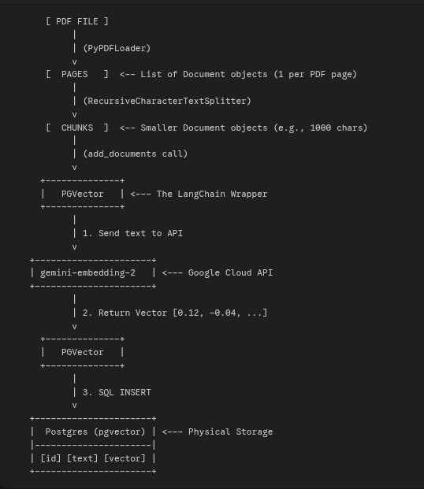
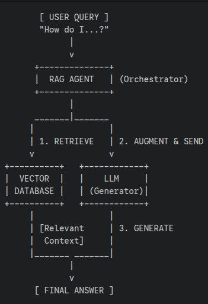

# Vector Database as Source Knowledge for LLMs

A practical guide to leveraging vector databases as external knowledge sources for LLMs. This project showcases semantic search and information retrieval through PDF document analysis and newspaper article summarization.  

### 🍀 Use Cases
*   **Technical Revision:** Query complex textbooks to clarify concepts and retrieve specific technical definitions.
*   **Media Analysis:** Summarize lengthy newspaper articles to extract key insights quickly.
  


🌈 Highly recommended reading: [Vector Databases](https://www.oreilly.com/library/view/vector-databases/9781098177584/)
## 🍀 Table of Contents

- [Vector Database as Source Knowledge for LLMs](#vector-database-as-source-knowledge-for-llms)
    - [🍀 Use Cases](#-use-cases)
  - [🍀 Table of Contents](#-table-of-contents)
  - [1. Embedding pipeline](#1-embedding-pipeline)
    - [1.1 Embedding](#11-embedding)
    - [1.2 Look inside the database](#12-look-inside-the-database)
  - [2. Query from Vector Database](#2-query-from-vector-database)
  - [3. Issues and open questions](#3-issues-and-open-questions)
    - [3.1 "Lost in the Middle" Phenomenon](#31-lost-in-the-middle-phenomenon)
    - [3.2 up-to-date the document with latest version (?)](#32-up-to-date-the-document-with-latest-version-)

## 1. Embedding pipeline
### 1.1 Embedding
This section demonstrates the process of embedding a PDF document into the vector database. The visual below illustrates the workflow:  
    

- output example:  

    

### 1.2 Look inside the database

This section describes how the data is stored within the PostgreSQL database using `PGVector`.

- A collection with the name `COLLECTION_NAME` is created on the `langchain_pg_collection` table, as shown below:

    ```python
        vector_store = PGVector(
            embeddings=embeddings,
            collection_name=COLLECTION_NAME,
            connection=CONNECTION_STRING,
            use_jsonb=True,
        )
    ```

    

- Rows are added to the `langchain_pg_embedding` table, where the `embedding` column is of type `vector`. These embeddings are the output of `vector_store.add_documents(chunks)`:

    

## 2. Query from Vector Database
A RAG agent first retrieves relevant data from a vector database and then forwards it to the LLM to generate a response.  
- 

- example:
    

- 🌈 compare similarity_search and as_retriever
  - similarity_search
    ```
            [ USER QUERY ] (String: "How do I...")
                |
                | 1. Invoke .similarity_search(query, k=5)
                v
        +------------------------------------------+
        |        LangChain / PGVector Class        |
        +------------------------------------------+
                |
                | 2. Call Embeddings Model
                v
        +------------------------------------------+
        |   gemini-embedding-2 (Google API)        |
        +------------------------------------------+
                |
                | 3. Return Query Vector
                |    [0.012, -0.453, 0.891, ...]
                v
        +------------------------------------------+
        |        PGVector (SQL Generator)          |
        +------------------------------------------+
                |
                | 4. Execute SQL Query:
                |    SELECT text, metadata, 
                |    embedding <=> '[vector]' as distance
                |    FROM langchain_pg_embedding
                |    ORDER BY distance ASC LIMIT 5;
                v
        +------------------------------------------+
        |       PostgreSQL (pgvector)              |
        +------------------------------------------+
                |
                | 5. Compute Vector Distance 
                |    (using HNSW Index if present)
                v
        +------------------------------------------+
        |          DB RESULT SET (Rows)            |
        +------------------------------------------+
                |
                | 6. Reconstruct into List[Document]
                v
        [ LIST OF CHUNKS ] (Top 5 most relevant)
    ```
  - as_retriever

    ```
        1. INITIALIZATION PHASE (Setup)
        -------------------------------
        [ vector_store ] 
            |
            | .as_retriever(search_kwargs={"k": 5})
            v
        +---------------------------------------+
        |       VectorStoreRetriever            |  <-- A "Runnable" Object
        |---------------------------------------|  
        | Config:                               |
        | - search_type: "similarity"           |  (Stored for later)
        | - search_kwargs: {"k": 5}             |
        +---------------------------------------+
            |
            |
        2. EXECUTION PHASE (When used in a Chain)
        -----------------------------------------
            | (Input: User Query String)
            v
        +-------------------------+
        |   retriever.invoke()    |
        +-------------------------+
            |
            | A. Auto-calls internally:
            |    vector_store.similarity_search(query, k=5)
            |
            | B. Internal Logic (Same as previous chart):
            |    - Embed Query
            |    - SQL Search
            |    - Return Documents
            v
        [ LIST OF DOCUMENTS ]
    ```
## 3. Issues and open questions
### 3.1 "Lost in the Middle" Phenomenon
**A Retrieval Gap**  
- **Symtom**  
    ```bash
    python3 chat.py 
    Both GOOGLE_API_KEY and GEMINI_API_KEY are set. Using GOOGLE_API_KEY.
    Both GOOGLE_API_KEY and GEMINI_API_KEY are set. Using GOOGLE_API_KEY.
    What would you like to know from the PDF? generate questions and their answers to revise chapter 3

    --- AI Agent is thinking ---

    --- Final Answer ---
    Based on the provided context, I can only see the section titles for Chapter 3, not the detailed content. Therefore, I cannot generate questions and their answers to revise the chapter's material.

    However, I can list the topics covered in Chapter 3:

    *   From Embeddings to Modern Language Models: The Transformer Connection
    *   Encoder-Only Transformers (BERT and Its Variants)
    *   Decoder-Only Transformers (GPT Family)
    *   Encoder-Decoder Transformers (T5, BART)
    *   Embedding Models: The Specialized Vector Generators
    *   Distinction from Traditional Models
    *   Role in Modern LLM Applications
    *   Practical Applications and Use Cases
    ```
- **The Cause:** Your similarity_search is likely returning the "Chapter 3" header chunk because it's a perfect keyword match, but it isn't returning the next 10 chunks that actually contain the data.  
  
- **The Fix:**
  - Increase your K-value (the number of retrieved chunks).  

    ```python
    # Change k from 5 to 10 or 15 to get more "depth" around the chapter title
    retriever = vector_store.as_retriever(search_kwargs={"k": 15})
    ```

  - redo the embedding with paramethers  
  
    ```python
        text_splitter = RecursiveCharacterTextSplitter(
            chunk_size=500,
            chunk_overlap=150,
            add_start_index=True # Keeps track of which page/char the text came from
        )
    ``` 

 - **After fix**  
    ```bash
    python3 chat.py 
    Both GOOGLE_API_KEY and GEMINI_API_KEY are set. Using GOOGLE_API_KEY.
    Both GOOGLE_API_KEY and GEMINI_API_KEY are set. Using GOOGLE_API_KEY.
    What would you like to know from the PDF? generate 10 questions and their answers to revise chapter 3

    --- AI Agent is thinking ---

    --- Final Answer ---
    Here are 10 questions and their answers to revise Chapter 3:

    1.  **Question:** What is the title of Chapter 3?
        **Answer:** Similarity Search with FAISS.

    2.  **Question:** On what page does Chapter 3, "Similarity Search with FAISS," begin?
        **Answer:** Page 53.

    3.  **Question:** What foundational concepts are discussed in Chapter 3 regarding similarity search?
        **Answer:** Foundations, Vector Representations, Distance Metrics, and Selection Heuristics.

    4.  **Question:** What topic is covered on page 55 of Chapter 3?
        **Answer:** Vector Representations.

    5.  **Question:** Where can you find information about "Distance Metrics" in Chapter 3?
        **Answer:** Page 56.

    6.  **Question:** What are "FAISS Indexes" and on what page are they introduced in Chapter 3?
        **Answer:** FAISS Indexes are a type of index used for similarity search, and they are introduced on page 58.

    7.  **Question:** Name at least three types of FAISS Indexes mentioned in Chapter 3.
        **Answer:** Flat Indexes (Brute Force), IVF-Based Indexes, LSH-Based Indexes, HNSW-Based Indexes, Other Specialized Indexes, and Composite and Transformative Indexes. (Any three of these are correct).

    8.  **Question:** Which type of FAISS Index is also referred to as "Brute Force"?
        **Answer:** Flat Indexes.

    9.  **Question:** What topic follows "Selection Heuristics" in Chapter 3?
        **Answer:** FAISS Indexes.

    10. **Question:** What is the final sub-topic discussed under FAISS Indexes in the provided context for Chapter 3?
        **Answer:** Choosing the Right Index.
    ```
### 3.2 up-to-date the document with latest version (?)