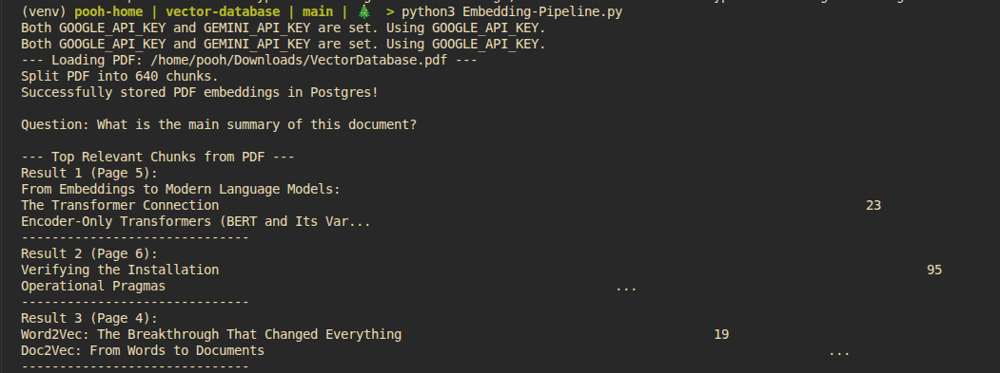
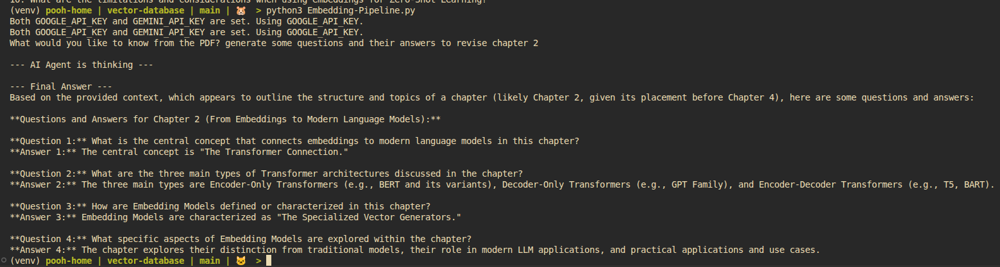

# Vector Database as Source Knowledge for LLMs

This repository provides an example of how to leverage a vector database as a source of knowledge for Large Language Models (LLMs).

## Table of Contents

- [Vector Database as Source Knowledge for LLMs](#vector-database-as-source-knowledge-for-llms)
  - [Table of Contents](#table-of-contents)
  - [0. System Architecture Diagram](#0-system-architecture-diagram)
  - [1. Embedding a PDF](#1-embedding-a-pdf)
  - [2. Query from Vector Database](#2-query-from-vector-database)
  - [3. Look inside database](#3-look-inside-database)
  - [4. More example](#4-more-example)

## 0. System Architecture Diagram

```
+-----------------------+
|       User Query      |
+-----------+-----------+
            |
            v
+-----------+-----------+
|  Langchain Application|
| (Python/LLM Logic)    |
+-----------+-----------+
            |  Uses Gemini Embedding 2
            v
+-----------+-----------+
| Gemini Embedding 2    |
| (Text to Vector)      |
+-----------+-----------+
            |  Generates Embeddings
            v
+-----------+-----------+
|  PGVector (PostgreSQL)|
| (Vector Database)     |
+-----------+-----------+
            |  Stores & Retrieves Vectors
            v
+-----------+-----------+
| Relevant Documents    |
| (from Vector Store)   |
+-----------+-----------+
            |
            v
+-----------+-----------+
|  Langchain Application|
| (Context for LLM)     |
+-----------+-----------+
            |
            v
+-----------------------+
|       LLM Response    |
+-----------------------+
```

## 1. Embedding a PDF

This section demonstrates the process of embedding a PDF document into the vector database. The visual below illustrates the workflow:



## 2. Query from Vector Database

Once the PDF is embedded, this section shows how to query the vector database to retrieve relevant information. The following image outlines the querying process:



## 3. Look inside database

This section describes how the data is stored within the PostgreSQL database using `PGVector`. A collection with the name `COLLECTION_NAME` is created on the `langchain_pg_collection` table, as shown below:

```python
    vector_store = PGVector(
        embeddings=embeddings,
        collection_name=COLLECTION_NAME,
        connection=CONNECTION_STRING,
        use_jsonb=True,
    )
```


Rows are added to the `langchain_pg_embedding` table, where the `embedding` column is of type `vector`. These embeddings are the output of `vector_store.add_documents(chunks)`:


## 4. More example
```bash
python3 Embedding-Pipeline.py
Both GOOGLE_API_KEY and GEMINI_API_KEY are set. Using GOOGLE_API_KEY.
Both GOOGLE_API_KEY and GEMINI_API_KEY are set. Using GOOGLE_API_KEY.
--- Loading PDF: /home/pooh/Downloads/84.pdf ---
Total Ingestion Tokens: ~2898.25
Total Ingestion Cost: $0.000058
Split PDF into 13 chunks.
Successfully stored PDF embeddings in Postgres!

Question: What is the main summary of this document?

--- Top Relevant Chunks from PDF ---
Result 1 (Page 2):
ROYAL OAK CONCEPT
C
ALIBRE 4407 Ø 43mm
C002...
------------------------------
Result 2 (Page 0):
The Mythosmoment
Can five men be trusted with AI?
The food shock from Iran
Who votes for Reform UK?
Venezuela after Maduro
J.D. V ance, righteous hypocrite
APRIL 18TH–24TH 2026
C002...
------------------------------
Result 3 (Page 7):
up from $3.17 a year ago. 
Oil trading stayed volatile,
with Brent crude fetching
between $95 and $100 a barrel.
The International Energy
Agency said the Iran conflict
had caused the “most severe
oil-s...
------------------------------

python3 chat.py 
Both GOOGLE_API_KEY and GEMINI_API_KEY are set. Using GOOGLE_API_KEY.
Both GOOGLE_API_KEY and GEMINI_API_KEY are set. Using GOOGLE_API_KEY.
What would you like to know from the PDF? tell me about "Artificial intelligence Examining the Mythos"

--- AI Agent is thinking ---

--- Final Answer ---
"Artificial intelligence Examining the Mythos" refers to a new AI model developed by Anthropic, an American artificial-intelligence lab.

Here's what the context says about it:
*   Anthropic announced on April 7th that Mythos would **not be released to the general public**.
*   This decision created both excitement and worry.
*   Access to Mythos will be **strictly controlled** under an initiative called **Project Glasswing**, whose 12 founder members include Apple, Google, and Nvidia.
*   The reason for this control is that Mythos is allegedly **exceptionally effective**, so much so that releasing it would **put the world’s digital infrastructure at risk**.
*   Anthropic claims Mythos has **surpassed "all but the most skilled humans"** in finding and exploiting security holes in various digital systems, from operating systems to cryptocurrency.
*   The topic is also framed with the question, "Can five men be trusted with AI?" highlighting concerns about its control.
```
