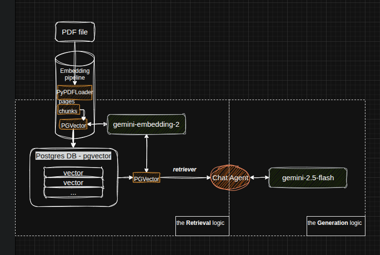
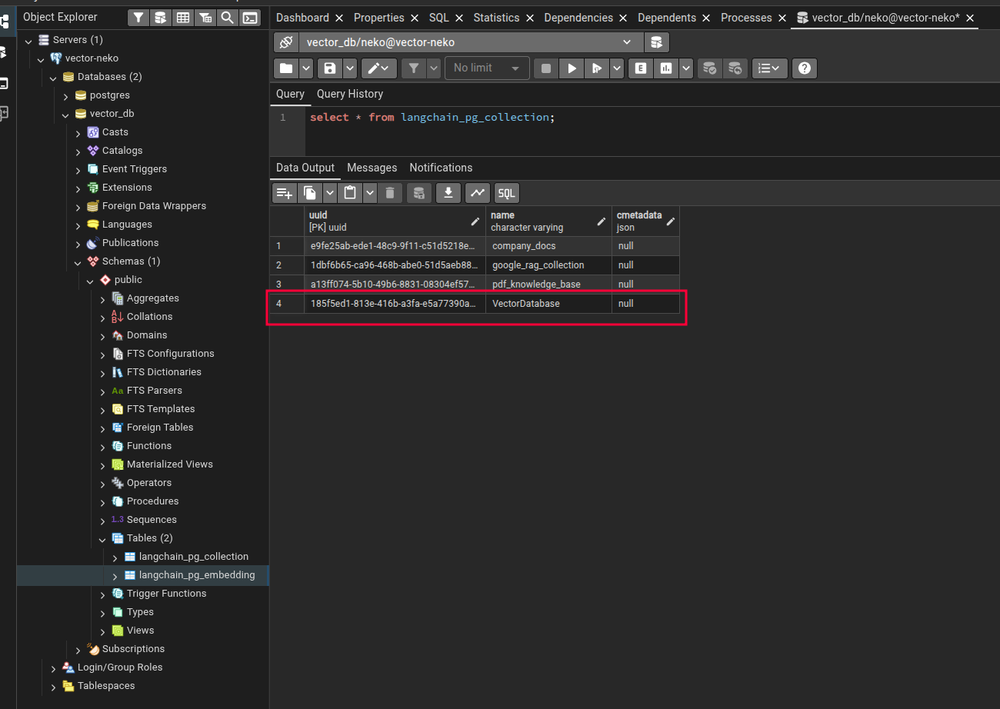
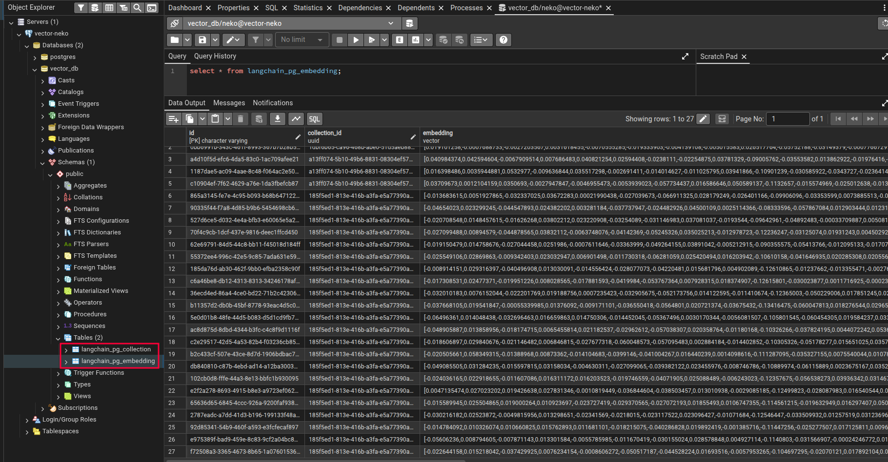

# Vector Database as Source Knowledge for LLMs

A practical guide to leveraging vector databases as external knowledge sources for Large Language Models (LLMs). This project showcases semantic search and information retrieval through PDF document analysis and newspaper article summarization.  

## ⋆˚꩜｡ Use Cases
*   **Technical Revision:** Query complex textbooks to clarify concepts and retrieve specific technical definitions.
*   **Media Analysis:** Summarize lengthy newspaper articles to extract key insights quickly.
  
*Illustrates the system overview*    

🌈 Highly recommended reading: [Vector Databases](https://www.oreilly.com/library/view/vector-databases/9781098177584/)
## ᨐฅ Table of Contents

- [Vector Database as Source Knowledge for LLMs](#vector-database-as-source-knowledge-for-llms)
  - [⋆˚꩜｡ Use Cases](#-use-cases)
  - [ᨐฅ Table of Contents](#ᨐฅ-table-of-contents)
  - [Setup](#setup)
    - [Environment Variables (`.env`)](#environment-variables-env)
    - [Package Dependencies](#package-dependencies)
    - [Start a pgvector server](#start-a-pgvector-server)
  - [Embedding PDF files and Usage](#embedding-pdf-files-and-usage)
    - [1. Embedding Process](#1-embedding-process)
    - [2. Inspecting the Database](#2-inspecting-the-database)
  - [Querying the Vector Database](#querying-the-vector-database)
    - [🌈 Compare `similarity_search()` and `as_retriever()`](#-compare-similarity_search-and-as_retriever)
    - [Example of a Chat Agent](#example-of-a-chat-agent)
    - [Monitoring SQL Queries with `SQL_ECHO=1`](#monitoring-sql-queries-with-sql_echo1)
  - [Issues](#issues)
    - [1. "Lost in the Middle" Phenomenon](#1-lost-in-the-middle-phenomenon)
  - [Todo](#todo)

## Setup  
Before diving deep into the vector database, let's go over the setup required for running the Python scripts. 

### Environment Variables (`.env`)
The following environment variables are necessary for running Python scripts. Set them in your `.env` file and source it before execution.

| Variable              | Description                                                               |
| :-------------------- | :------------------------------------------------------------------------ |
| `DB_PASSWORD`         | Password for the PostgreSQL database user.                                |
| `GEMINI_API_KEY`      | Your API key for accessing the Google Gemini API.                         |
| `COLLECTION_NAME`     | The name of the collection in PGVector where embeddings are stored.       |
| `PDF_HASH_CACHE_FILE` | Path to the JSON file used for caching PDF hashes to avoid re-embedding. |
| `SQL_ECHO`            | Set to `1` to enable SQLAlchemy SQL echo (for debugging), `0` to disable. |

### Package Dependencies
```bash
python3 -m venv venv
source venv/bin/activate
pip install langchain-postgres psycopg[binary] langchain-google-genai
pip install pypdf
```

### Start a pgvector server
```bash
./pg-setup.sh
```
 
## Embedding PDF files and Usage 
🌟 [PostgreSQL Database Maintenance](../docs/postgres.md)   
🌟 LangChain Package Components
|No.|Function|Description|
|--|--|--|
|01|[PGVector](https://docs.langchain.com/oss/python/integrations/vectorstores/pgvector)|An implementation of LangChain's vectorstore abstraction using Postgres as the backend and utilizing the pgvector extension.|
|02|[PyPDFLoader](https://docs.langchain.com/oss/python/integrations/document_loaders/pypdfloader)|Loads PDF files into a list of `Document` objects, where each document represents a page.|
|03|[RecursiveCharacterTextSplitter](https://reference.langchain.com/python/langchain-text-splitters/character/RecursiveCharacterTextSplitter)|Splits `Document` objects (pages) into smaller `chunks` based on specified `chunk_size` and `chunk_overlap`.|
|04|[GoogleGenerativeAIEmbeddings](https://docs.langchain.com/oss/python/integrations/embeddings/google_generative_ai)|Provides access to the Google Gemini embedding model, which is used as a parameter for `PGVector` to generate vector representations of text.|
|05|[ChatGoogleGenerativeAI](https://docs.langchain.com/oss/python/integrations/chat/google_generative_ai)|Provides access to Google's generative Gemini models, used for conversational AI agents.|  

🌟 Gemini Models  
- [gemini-embedding-2](https://docs.cloud.google.com/vertex-ai/generative-ai/docs/models/gemini/embedding-2)
- [gemini-2.5-flash](https://docs.cloud.google.com/vertex-ai/generative-ai/docs/models/gemini/2-5-flash)
### 1. Embedding Process
This section demonstrates the process of embedding a PDF document into the vector database. 
 - The visual below illustrates the workflow:  

    ```bash
        [ PDF FILE ]
            |
            | (PyPDFLoader)
            v
        [  PAGES   ]  <-- List of Document objects (1 per PDF page)
            |
            | (RecursiveCharacterTextSplitter)
            v
        [  CHUNKS  ]  <-- Smaller Document objects (e.g., 1000 chars)
            |
            | (add_documents call)
            v
    +-----------------------+
    |       PGVector        |  <--- The LangChain Wrapper
    +-----------------------+
            |
            | 1. Send text to API
            v
    +-----------------------+
    |  gemini-embedding-2   |  <--- Google Cloud API
    +-----------------------+
            |
            | 2. Return Vector [0.12, -0.04, ...]
            v
    +-----------------------+
    |       PGVector        |
    +-----------------------+
            |
            | 3. SQL INSERT
            v
    +-----------------------+
    |  Postgres (pgvector)  |  <--- Physical Storage
    |-----------------------|
    | [id] [text] [vector]  |
    +-----------------------+
    ```

- Output Example:  
    ```bash
    python3 PDFEmbedding.py --pdf ./TheEconomistUK_1804.pdf
    --- Loading PDF: ./TheEconomistUK_1804.pdf ---
    Split PDF into 685 chunks.
    ⋆˚꩜｡  Total Tokens: ~153017.5
    ≽^- ˕ -^≼ ᶻ 𝗓 𐰁 Total Cost: $0.003060
    Successfully stored PDF embeddings in Postgres!

    Question: What is the main summary of this document?

    --- Top Relevant Chunks from PDF ---
    Result 1 (Page 0):
    The Mythosmoment
    Can five men be trusted with AI?
    The food shock from Iran
    Who votes for Reform UK?
    Venezuela after Maduro
    J.D. V ance, righteous hypocrite
    APRIL 18TH–24TH 2026
    C002...
    ----------------------------------------------------------------------------------------------------
    Result 2 (Page 6):
    spending from 2% of GDP to 3%
    by 2033. Australia “faces its
    most complex and threatening
    strategic circumstances” since
    the second world war, said the
    defence minister. 
    The head of the International
    ...
    ----------------------------------------------------------------------------------------------------
    Result 3 (Page 6):
    tives crossed over to the Liber-
    als in recent months. 
    Keiko Fujimori advanced to the
    second round of Peru’s presi-
    dential election. It is her fourth
    run for the office. Ms Fujimori
    is the daughter ...
    ----------------------------------------------------------------------------------------------------
    ⋆˚꩜｡  Total Tokens: ~10.5
    ≽^- ˕ -^≼ ᶻ 𝗓 𐰁 Total Cost: $0.000000

    python3 PDFEmbedding.py --pdf ./TheEconomistUK_1804_9-10.pdf
    PDF with hash 3b06c4bb2bf55df94070c5fbb596e08 found in local cache. Skipping embedding.

    Question: What is the main summary of this document?

    --- Top Relevant Chunks from PDF ---
    Result 1 (Page 0):
    Leaders 9The Economist April 18th 2026
    /uni23E9
    S
    HOULD A HANDFUL of men be entrusted with the world’s
    most potent new technology? Five geeks so famous that
    they can be identified by their first names—D...
    ----------------------------------------------------------------------------------------------------
    ⋆˚꩜｡  Total Tokens: ~10.5
    ≽^- ˕ -^≼ ᶻ 𝗓 𐰁 Total Cost: $0.000000
    ```

### 2. Inspecting the Database

This section describes how the data is stored within the PostgreSQL database.

- A collection with the name `COLLECTION_NAME` is created in the `langchain_pg_collection` table, as shown below:

    

- Rows are added to the `langchain_pg_embedding` table, where the `embedding` column is of type `vector`. These embeddings are the output of `vector_store.add_documents(chunks)`:

    

## Querying the Vector Database  
To query a vector database, use `.similarity_search()` to return documents directly, or use `.as_retriever()` to integrate the search logic into an AI agent or chain.

### 🌈 Compare `similarity_search()` and `as_retriever()`  

| Feature            | `vector_store.similarity_search()`                 | `vector_store.as_retriever()`                                          |
| :----------------- | :------------------------------------------------- | :--------------------------------------------------------------------- |
| **Purpose**        | Directly perform a similarity search.              | Create a configurable retriever object for use in LangChain chains.    |
| **Invocation**     | Immediate execution with `query` and `k` parameters. | Returns a `Runnable` object; actual search occurs on `.invoke()`.      |
| **Flexibility**    | Less flexible; direct search.                      | Highly configurable (`search_type`, `search_kwargs`, etc.).             |
| **Return Type**    | `List[Document]` (list of chunks).                 | `List[Document]` (list of chunks).                                     |
| **Use Case**       | Ad-hoc, single similarity searches.                | Integrated into larger RAG chains, agents, and conversational flows. |
| **Internals**      | Embeds query, generates SQL, executes, returns docs. | Internally calls `similarity_search` when invoked. |
  - `similarity_search()` Workflow
    ```
            [ USER QUERY ] (String: "How do I...")
                |
                | 1. Invoke .similarity_search(query, k=5)
                v
        +------------------------------------------+
        |        LangChain / PGVector Class        |
        +------------------------------------------+
                |
                | 2. Call Embeddings Model
                v
        +------------------------------------------+
        |   gemini-embedding-2 (Google API)        |
        +------------------------------------------+
                |
                | 3. Return Query Vector
                |    [0.012, -0.453, 0.891, ...]
                v
        +------------------------------------------+
        |        PGVector (SQL Generator)          |
        +------------------------------------------+
                |
                | 4. Execute SQL Query:
                |    SELECT text, metadata, 
                |    embedding <=> '[vector]' as distance
                |    FROM langchain_pg_embedding
                |    ORDER BY distance ASC LIMIT 5;
                v
        +------------------------------------------+
        |       PostgreSQL (pgvector)              |
        +------------------------------------------+
                |
                | 5. Compute Vector Distance 
                |    (using HNSW Index if present)
                v
        +------------------------------------------+
        |          DB RESULT SET (Rows)            |
        +------------------------------------------+
                |
                | 6. Reconstruct into List[Document]
                v
        [ LIST OF CHUNKS ] (Top 5 most relevant)
    ```
  - `as_retriever()` Workflow

    ```
        1. INITIALIZATION PHASE (Setup)
        -------------------------------
        [ vector_store ] 
            |
            | .as_retriever(search_kwargs={"k": 5})
            v
        +---------------------------------------+
        |       VectorStoreRetriever            |  <-- A "Runnable" Object
        |---------------------------------------|  
        | Config:                               |
        | - search_type: "similarity"           |  (Stored for later)
        | - search_kwargs: {"k": 5}             |
        +---------------------------------------+
            |
            |
        2. EXECUTION PHASE (When used in a Chain)
        -----------------------------------------
            | (Input: User Query String)
            v
        +-------------------------+
        |   retriever.invoke()    |
        +-------------------------+
            |
            | A. Auto-calls internally:
            |    vector_store.similarity_search(query, k=5)
            |
            | B. Internal Logic (Same as previous chart):
            |    - Embed Query
            |    - SQL Search
            |    - Return Documents
            v
        [ LIST OF DOCUMENTS ]
    ```
### Example of a Chat Agent
```bash
python3 chat.py 
What would you like to know from the TheEconomist? (Type 'exit' toquit)
tells me 5 things about Mythos moment
--- AI Agent is thinking ---
--- Token Usage & Cost ---
Input Tokens: 79
Output Tokens: 78
Estimated Cost: $0.000039
--- Final Answer ---
The "Mythos moment" is:
1. A topic discussed in The Economist.
2. Related to Artificial Intelligence (AI).
3. Poses the question: "Can five men be trusted with AI?"
4. Is a "leader" article on page 9.
5. Is connected to America's government waking up to the dangers ofartificial intelligence.
---------------------------------------------------------------------------------------------------
What would you like to know from the TheEconomist? (Type 'exit' toquit)
exit
Exiting chat. Goodbye!
```  

### Monitoring SQL Queries with `SQL_ECHO=1`  
*Setting the `SQL_ECHO` environment variable to `1` enables SQLAlchemy's SQL echo, we can see the underlying SQL queries executed against the database.*  

- Run PDFEmbedding.py with `SQL_ECHO=1`:

```bash
export SQL_ECHO=1
python3 PDFEmbedding.py --pdf /home/pooh/Downloads/TheEconomistUK_1804.pdf
```

- Below is an example of the output you might see, demonstrating the SQL queries generated and executed:

```bash
2026-05-02 10:48:47,591 INFO sqlalchemy.engine.Engine select pg_catalog.version()
2026-05-02 10:48:47,592 INFO sqlalchemy.engine.Engine [raw sql] {}
2026-05-02 10:48:47,593 INFO sqlalchemy.engine.Engine select current_schema()
2026-05-02 10:48:47,593 INFO sqlalchemy.engine.Engine [raw sql] {}
2026-05-02 10:48:47,593 INFO sqlalchemy.engine.Engine show standard_conforming_strings
2026-05-02 10:48:47,593 INFO sqlalchemy.engine.Engine [raw sql] {}
2026-05-02 10:48:47,595 INFO sqlalchemy.engine.Engine BEGIN (implicit)
2026-05-02 10:48:47,595 INFO sqlalchemy.engine.Engine SELECT pg_advisory_xact_lock(1573678846307946496);CREATE EXTENSION IF NOT EXISTS vector;
2026-05-02 10:48:47,595 INFO sqlalchemy.engine.Engine [generated in 0.00011s] {}
2026-05-02 10:48:47,595 INFO sqlalchemy.engine.Engine COMMIT
2026-05-02 10:48:47,600 INFO sqlalchemy.engine.Engine BEGIN (implicit)
2026-05-02 10:48:47,602 INFO sqlalchemy.engine.Engine SELECT pg_catalog.pg_class.relname 
FROM pg_catalog.pg_class JOIN pg_catalog.pg_namespace ON pg_catalog.pg_namespace.oid = pg_catalog.pg_class.relnamespace 
WHERE pg_catalog.pg_class.relname = %(table_name)s::VARCHAR AND pg_catalog.pg_class.relkind = ANY (ARRAY[%(param_1)s::VARCHAR, %(param_2)s::VARCHAR, %(param_3)s::VARCHAR, %(param_4)s::VARCHAR, %(param_5)s::VARCHAR]) AND pg_catalog.pg_table_is_visible(pg_catalog.pg_class.oid) AND pg_catalog.pg_namespace.nspname != %(nspname_1)s::VARCHAR
2026-05-02 10:48:47,602 INFO sqlalchemy.engine.Engine [generated in 0.00015s] {'table_name': 'langchain_pg_collection', 'param_1': 'r', 'param_2': 'p', 'param_3': 'f', 'param_4': 'v', 'param_5': 'm', 'nspname_1': 'pg_catalog'}
2026-05-02 10:48:47,603 INFO sqlalchemy.engine.Engine SELECT pg_catalog.pg_class.relname 
FROM pg_catalog.pg_class JOIN pg_catalog.pg_namespace ON pg_catalog.pg_namespace.oid = pg_catalog.pg_class.relnamespace 
WHERE pg_catalog.pg_class.relname = %(table_name)s::VARCHAR AND pg_catalog.pg_class.relkind = ANY (ARRAY[%(param_1)s::VARCHAR, %(param_2)s::VARCHAR, %(param_3)s::VARCHAR, %(param_4)s::VARCHAR, %(param_5)s::VARCHAR]) AND pg_catalog.pg_table_is_visible(pg_catalog.pg_class.oid) AND pg_catalog.pg_namespace.nspname != %(nspname_1)s::VARCHAR
2026-05-02 10:48:47,603 INFO sqlalchemy.engine.Engine [cached since 0.001696s ago] {'table_name': 'langchain_pg_embedding', 'param_1': 'r', 'param_2': 'p', 'param_3': 'f', 'param_4': 'v', 'param_5': 'm', 'nspname_1': 'pg_catalog'}
2026-05-02 10:48:47,604 INFO sqlalchemy.engine.Engine COMMIT
2026-05-02 10:48:47,607 INFO sqlalchemy.engine.Engine BEGIN (implicit)
2026-05-02 10:48:47,608 INFO sqlalchemy.engine.Engine SELECT langchain_pg_collection.uuid AS langchain_pg_collection_uuid, langchain_pg_collection.name AS langchain_pg_collection_name, langchain_pg_collection.cmetadata AS langchain_pg_collection_cmetadata 
FROM langchain_pg_collection 
WHERE langchain_pg_collection.name = %(name_1)s::VARCHAR 
 LIMIT %(param_1)s::INTEGER
2026-05-02 10:48:47,608 INFO sqlalchemy.engine.Engine [generated in 0.00011s] {'name_1': 'TheEconomist', 'param_1': 1}
2026-05-02 10:48:47,609 INFO sqlalchemy.engine.Engine COMMIT
PDF with hash 0501d7b0e9487901f9a1f0b48c5d60d35290acfe5716440f0c682172eed2e155 found in local cache. Skipping embedding.

≽^- ˕ -^≼ ᶻ 𝗓 𐰁       Total Tokens: ~10.5
⊹ ࣪ ﹏𓊝﹏𓂁﹏⊹ ࣪ ˖      Total Cost  : $0.000000


Question: What is the main summary of this document?
2026-05-02 10:48:48,329 INFO sqlalchemy.engine.Engine BEGIN (implicit)
2026-05-02 10:48:48,329 INFO sqlalchemy.engine.Engine SELECT langchain_pg_collection.uuid AS langchain_pg_collection_uuid, langchain_pg_collection.name AS langchain_pg_collection_name, langchain_pg_collection.cmetadata AS langchain_pg_collection_cmetadata 
FROM langchain_pg_collection 
WHERE langchain_pg_collection.name = %(name_1)s::VARCHAR 
 LIMIT %(param_1)s::INTEGER
2026-05-02 10:48:48,330 INFO sqlalchemy.engine.Engine [cached since 0.7215s ago] {'name_1': 'TheEconomist', 'param_1': 1}
2026-05-02 10:48:48,333 INFO sqlalchemy.engine.Engine SELECT langchain_pg_embedding.id AS langchain_pg_embedding_id, langchain_pg_embedding.collection_id AS langchain_pg_embedding_collection_id, langchain_pg_embedding.embedding AS langchain_pg_embedding_embedding, langchain_pg_embedding.document AS langchain_pg_embedding_document, langchain_pg_embedding.cmetadata AS langchain_pg_embedding_cmetadata, langchain_pg_embedding.embedding <=> %(embedding_1)s AS distance 
FROM langchain_pg_embedding JOIN langchain_pg_collection ON langchain_pg_embedding.collection_id = langchain_pg_collection.uuid 
WHERE langchain_pg_embedding.collection_id = %(collection_id_1)s::UUID ORDER BY distance ASC 
 LIMIT %(param_1)s::INTEGER
2026-05-02 10:48:48,333 INFO sqlalchemy.engine.Engine [generated in 0.00046s] {'embedding_1': '[-0.0028502591885626316,0.02270953729748726,-0.009346078149974346,0.0013615189818665385,-0.013808928430080414,-0.003300690557807684,-0.05863662064075 ... (16054 characters truncated) ... 246,0.008078503422439098,0.01960768550634384,0.018838968127965927,-0.0376226007938385,0.006854148115962744,0.03453807532787323,-0.009696299210190773]', 'collection_id_1': UUID('71b3676e-8636-47e9-a2fb-196c32c41486'), 'param_1': 3}
2026-05-02 10:48:48,337 INFO sqlalchemy.engine.Engine ROLLBACK
```

## Issues
### 1. "Lost in the Middle" Phenomenon
**A Retrieval Gap**  
- **Symptom**  
    ```bash
    python3 chat.py 
    What would you like to know from the PDF? generate questions and their answers to revise chapter 3

    --- AI Agent is thinking ---

    --- Final Answer ---
    Based on the provided context, I can only see the section titles for Chapter 3, not the detailed content. Therefore, I cannot generate questions and their answers to revise the chapter's material.

    However, I can list the topics covered in Chapter 3:

    *   From Embeddings to Modern Language Models: The Transformer Connection
    *   Encoder-Only Transformers (BERT and Its Variants)
    *   Decoder-Only Transformers (GPT Family)
    ...
    ```
- **The Cause:** Your `similarity_search` is likely returning the "Chapter 3" header chunk because it's a perfect keyword match, but it isn't returning the next 10 chunks that actually contain the data.  
  
- **The Fix:**
  - Increase your K-value (the number of retrieved chunks).  

    ```python
    # Change k from 5 to 10 or 15 to get more "depth" around the chapter title
    retriever = vector_store.as_retriever(search_kwargs={"k": 15})
    ```

  - Redo the embedding with adjusted parameters.  
  
    ```python
        text_splitter = RecursiveCharacterTextSplitter(
            chunk_size=500,
            chunk_overlap=150,
            add_start_index=True # Keeps track of which page/char the text came from
        )
    ``` 

 - **After Fix**  
    ```bash
    python3 chat.py 
    What would you like to know from the PDF? generate 10 questions and their answers to revise chapter 3

    --- AI Agent is thinking ---

    --- Final Answer ---
    Here are 10 questions and their answers to revise Chapter 3:

    1.  **Question:** What is the title of Chapter 3?
        **Answer:** Similarity Search with FAISS.

    2.  **Question:** On what page does Chapter 3, "Similarity Search with FAISS," begin?
        **Answer:** Page 53.

    3.  **Question:** What foundational concepts are discussed in Chapter 3 regarding similarity search?
        **Answer:** Foundations, Vector Representations, Distance Metrics, and Selection Heuristics.

    4.  **Question:** What topic is covered on page 55 of Chapter 3?
        **Answer:** Vector Representations.

    ...
    ```
## Todo  
|No.|Description|Status|
|--|--|--|
|01|Update the document with the latest version|Open|
|02|Adjust RecursiveCharacterTextSplitter parameters and compare the results|Open|
